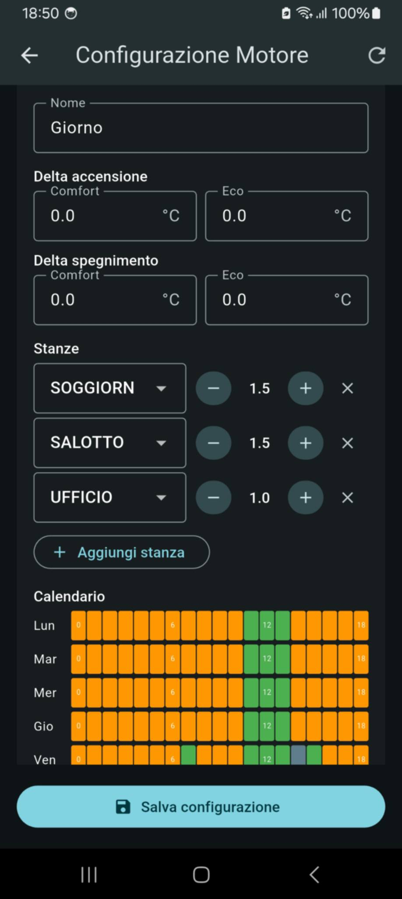
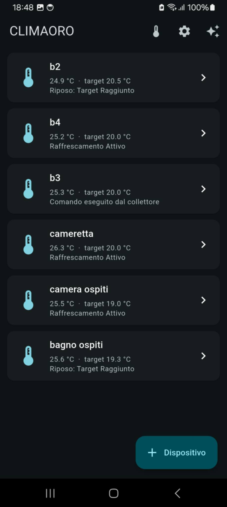

# CLIMAORO Motore
**Il cervello stand-alone per la gestione intelligente del riscaldamento a pavimento su ESP32-S3.**

- **Sito web:** [https://UVAVIVA.github.io/CLIMAORO/](https://UVAVIVA.github.io/CLIMAORO/)
- **Progetto principale:** [https://github.com/UVAVIVA/CLIMAORO](https://github.com/UVAVIVA/CLIMAORO)

---

## 📖 L'Idea

CLIMAORO nasce per risolvere un problema concreto: coordinare il riscaldamento di un appartamento multiproprieta in modo fluido, affidabile e senza punti unici di fallimento.

Nelle prime versioni, la logica decisionale risiedeva all'interno di Home Assistant tramite uno script AppDaemon. Sebbene funzionante, la soluzione soffriva di un limite strutturale: l'infrastruttura di riscaldamento dipendeva dalla stabilita dell'infrastruttura domotica generale. Se il server si bloccava o andava in manutenzione, l'impianto smetteva di prendere decisioni.

La svolta e stata la **decentralizzazione**: trasferire l'intero motore decisionale su un microcontrollore dedicato ESP32-S3. Un hardware essenziale, economico e privo di dipendenze esterne. Ogni 60 secondi valuta i sensori, consulta il calendario di zona e comanda i termostati. Senza server, senza cloud, senza interruzioni.

 

---

## 🧩 Come Funziona

L'architettura del sistema si articola su tre livelli ben distinti:

| Componente | Ruolo | Descrizione |
| --- | --- | --- |
| **Termostati** | *Esecutori* | ESP32 periferici posizionati nelle singole stanze. Leggono temperatura e umidita, pilotano gli attuatori del pavimento radiante ed espongono endpoint web in rete locale. |
| **Motore** *(questo firmware)* | *Coordinatore* | Interroga periodicamente i termostati via HTTP/SSE, applica le regole di gruppo e la matrice oraria, inviando i comandi di accensione o spegnimento. |
| **App** | *Interfaccia* | Client multipiattaforma (Flutter) per monitoraggio e configurazione. **Il motore e del tutto autonomo**: se l'app e chiusa o disconnessa, la regolazione prosegue indisturbata. |

 

---

## 🧠 Logica Decisionale

Il motore opera sulla base di una matrice settimanale (7 giorni x 24 ore) con tre stati operativi per ogni blocco orario:

| Stato | Descrizione |
| --- | --- |
| **Comfort** | Riscaldamento attivo puntato al setpoint di regime |
| **Eco** | Modalita a risparmio energetico con setpoint ridotto |
| **Autonomo** | Il motore sospende l'algoritmo centrale e lascia la stanza al controllo locale del termostato |

### 🔄 Algoritmo di Gruppo e Priorita

Quando una zona lavora in modalita *Comfort* o *Eco*, le stanze vengono organizzate in **gruppi**. Per ciascun gruppo l'algoritmo valuta:

1. **Delta di Ingresso / Uscita**: Margini termici dedicati per attivazione e spegnimento.
2. **Soglia Pesi**: Una somma pesata dei fabbisogni delle stanze per evitare micro-accensioni inefficienti del generatore.
3. **Priorita di Mantenimento**: Se una stanza del gruppo e gia in fase di riscaldamento (`heating`), ha la precedenza e mantiene l'impianto attivo.
4. **Verifica della Centralizzata**: Prima di ogni cambio di setpoint, il motore verifica che la modalita centralizzata sia attiva sul termostato destinatario (con retry fino a 2 tentativi).

---

## 🔧 Specifiche Hardware

| Parametro | Dettaglio |
| --- | --- |
| **SoC** | ESP32-S3 (Dual-Core Xtensa LX7 @ 240MHz) |
| **Memoria** | 16 MB Flash, 8 MB PSRAM (utilizzata per lo stato dei dispositivi senza frammentare la SRAM) |
| **Interfaccia USB/Seriale** | CH343 (Baudrate log: 115200) |
| **Capacita Massima** | Fino a **16 dispositivi/termostati** gestibili in parallelo |
| **Integrazione** | Moduli ESPHome esistenti (nessun firmware custom richiesto sui termostati) |

---

## ⚙️ Configurazione

Tutte le definizioni di appartamenti, gruppi, stanze e calendari si gestiscono dinamicamente via App o chiamate REST (con salvataggio persistente in memoria NVS).

Gli unici due parametri di avvio richiesti a codice sono:

1. **Rete & IP Statico**: Copia `src/secrets.h.example` in `src/secrets.h` e imposta credenziali Wi-Fi e IP riservato. *(Il file `secrets.h` e escluso dal tracciamento Git).*
2. **Mappatura Hardware**: Nel file `src/devices.c`, definisci la tabella iniziale dei termostati (ID ESPHome, nome e indirizzo IP locale).

---

## 🔨 Build e Flash

- **[ISTRUZIONI PER L'INSTALLAZIONE](ISTRUZIONI.md)**
- **[Download install.bat](https://github.com/UVAVIVA/climaoro-motore/raw/main/install.bat)**

Il progetto si basa sul framework **ESP-IDF** integrato in **PlatformIO**.

### Compilazione

```bash
pio run
```

Il file binario generato sara disponibile in `.pio/build/climaoro-motore/firmware.bin`.

### Flash tramite esptool

```bash
esptool.py --port COMx --baud 460800 write_flash 0x10000 .pio/build/climaoro-motore/firmware.bin
```

*(Sostituisci `COMx` con la porta seriale corrispondente al tuo sistema).*

---

## 🌐 API REST

Il motore espone un set completo di API HTTP per l'integrazione con l'App e con sistemi terzi:

| Endpoint | Descrizione |
| --- | --- |
| `/api/status` | Stato Globale |
| `/api/devices` | Gestione Dispositivi |
| `/api/engine/state`, `/api/engine/master` | Logica Decisionale & Matrice |
| `/api/config` | Configurazione e Regole |

---

## 📜 Licenza e Responsabilita

**CLIMAORO (c) 2026 by UVAVIVA** · Licenza: **MIT con Condizione di Attribuzione**

**Termini**
- ✅ Attribuzione richiesta (nel codice e sui dispositivi commerciali)
- ✅ Uso commerciale permesso (con attribuzione)
- ✅ Modifiche e derivati permessi
- ✅ Uso, copia, distribuzione e vendita permessi

**Disclaimer**
Questo progetto e fornito **cosi com'e**, a scopo educativo e sperimentale.
- ⚠️ Non certificato per uso produttivo
- ⚠️ ⚡ **PERICOLO: gli interventi sull'impianto elettrico e termoidraulico devono essere eseguiti solo da personale qualificato**
- ⚠️ Nessuna garanzia di alcun tipo
- ⚠️ L'utente si assume ogni rischio

**Rispettare sempre le norme elettriche e di sicurezza locali.**

**Sviluppato da:** [UVAVIVA](https://github.com/UVAVIVA)

---

**Costruito con passione, dal nulla.**
